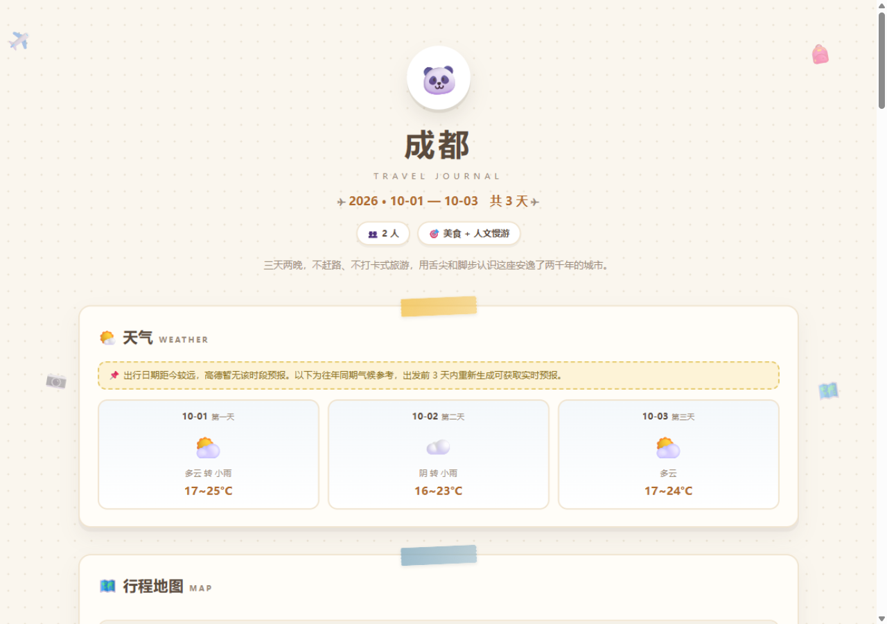

# 🧳 travel-planner · 旅行出行规划 Skill

> ZCode（智灵助手）技能：输入「日期 + 目的地 + 偏好」，调用高德地图 MCP 获取真实数据，
> 生成一份**清新手账风的单文件 HTML 出行手账**。
>
> A ZCode skill that turns "dates + destination + preferences" into a beautiful
> journal-style travel plan page, powered by the AMap (高德) MCP server.



## ✨ 生成内容

- 🌤️ **天气** — 高德实时预报；出行日超出预报窗口时自动切换为「往年同期气候参考」
- 🗺️ **交互地图** — 高德 JS API：景点贴纸标记、当日动线虚线、分日筛选、点击查看详情
- 📅 **逐日行程时间轴** — 按商圈聚类分天，含每段「🚶 步行约 12 分钟 / 🚇 地铁 4 号线」式交通衔接
- 🍜 **美食推荐** — 时间轴正餐 + 加餐好店（苍蝇馆子、街头小吃、夜宵）
- 💰 **预算参考** — 门票/餐饮/交通/住宿/手信，人均自动求和
- 🏨 **住宿区域建议** — 推荐住哪个商圈、为什么、2~3 档具体酒店
- 💡 **出行贴士** — 穿搭、购票、避坑、当地暗号

单文件自包含，除高德地图 CDN 外零依赖；未配置 Key 或离线打开时地图区优雅降级，其余模块照常显示。

## 🚀 安装

```bash
git clone https://github.com/xiaogao007/travel-planner.git ~/.agents/skills/travel-planner
```

克隆到 `~/.agents/skills/`（个人级，全项目可用）或 `<project>/.zcode/skills/`（仅当前项目）后，新开一个 ZCode 会话即可被识别。

## 🔑 前置配置（两把钥匙）

skill 依赖两种高德 Key，申请与配置的完整步骤见 [`references/setup-amap.md`](references/setup-amap.md)：

| Key 类型 | 用途 | 存放位置 |
|---|---|---|
| Web服务 | 供 MCP 调 REST API（天气/POI/路径） | `~/.zcode/cli/config.json` 的 `mcp.servers` |
| Web端(JS API) + 安全密钥 | 页面里的交互地图 | `~/.travel-planner.json` |

## 🗣️ 使用

对 ZCode 说任何出行规划需求都会触发，例如：

```
帮我规划 10 月 1 日到 3 日去成都的旅行，2 个人，喜欢美食和人文景点
下周末带爸妈去杭州玩两天，节奏慢一点，做完给我一个页面
/travel-planner 2026-10-06 厦门 3 天，喜欢海边和小吃
```

产出：`travel-plans/<目的地>-<日期>.html`，双击即可打开（地图需联网）。

## 📁 结构

```
travel-planner/
├── SKILL.md                 # 技能入口：工作流程与硬性要求
├── references/
│   ├── setup-amap.md        # 高德 Key 申请 + ZCode MCP 配置指引
│   ├── amap-mcp.md          # 高德 MCP 工具清单与取数/选点/编排策略
│   └── page-design.md       # 页面模板、PLAN 数据 schema、文案标准
└── assets/
    └── template.html        # 手账风页面模板（JSON 数据驱动渲染）
```

## 📄 License

[MIT](LICENSE)
